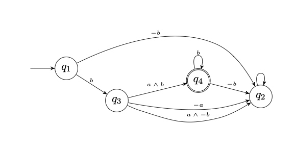

# Automata for dynamic answer set solving (*atlingo*)

This framework implements temporal constraints expressed in an extension of Answer Set Programming (ASP) with language constructs from dynamic logic.
It transforms dynamic constraints into an automaton expressed in terms of a logic program that enforces the satisfaction of the original constraint.
## Setup 

- Install dependencies using [conda](https://anaconda.org) with the [environment.yml](environment.yml) file

```shell
conda env create -f environment.yml
```

- Install manually `MONA` from [this](https://www.brics.dk/mona/download.html) instructions

- Update git-submodules. 
```shell
git submodule update --init --recursive
```

- Check the installation by running the tests

```
make tests -B
```

-------
## Benchmarks

More [information](./benchmarks/README.md) on how to run benchmarks

-------

## Domain Specific Knowledge

All domain specific knowledge can be found in the directory [./dom](./dom). Each sub-directory has the name of the domain `$DOM`

Each these folders has the following elements:
- `instances\` folder with all instances
- `temporal_constraints\` folder with all temporal constraints
- `glue.lp` File mapping all predicates used in the constraint to predicate `trace/2`. Used in automata approaches and must be  handcrafted.
- `telingo_choices.lp` Adds a choice for every predicate used in the constraint. Used by the telingo approach.

To integrate the a new domain with the make file add parameter `RUN_DOM_FILES_$DOM` with the paths to the encodings of the problem. We recommend storing those encodings inside the domain folder. 

-------

## Dynamic Constraints

The accepted dynamic constraints have the form:
```
:- not &del{<formula here>}, <additional predicates>.
```
**Example** [dom/test/temporal_constraints/example.lp](./dom/test/temporal_constraints/example.lp) 

  The syntax for the LDLf formulas is defined in [encodings/translations/grammar.lp](./encodings/translations/grammar.lp)

-------

##  Translate

#### `make translate`

```
make translate DOM=$DOM APP=$APP CONSTRAINT=$CNAME INSTANCE=$INSTANCEPATH HORIZON=$H
```

- `$DOM` Name of the domain (folder inside `./dom`)
- `$APP` Approach name 
  - `awf` Translates to an alternating automata using meta-programming
  - `dfa-mso` Translates to a deterministic automata using MONA and the mso translation from ldlf
  - `dfa-stm` Translates to a deterministic automata using MONA and the stm translation from ldlf
  - `nfa` Translates to a non-deterministic by first computing the afw and then calling python 
  - `nfa-awf` Translates to a non-deterministic by first computing the afw and then using an asp encoding
  - `telingo` Translates to a logic program using adaptation of telingo
  - `nc` The constraint is not considered
- `$CNAME` Constraint name  `./dom/$DOM/temporal_constraints/$CNAME.lp`
- `$INSTANCEPATH` Path to the instance
- `$H` Horizon (Number of time steps) only needed for `telingo` approach
- `$H` Horizon (Number of time steps) only needed for `telingo` approach

All output files can be found in the `outputs` directory

##### Example 
```
make translate DOM=test APP=afw CONSTRAINT=delex INSTANCE=dom/test/instances/delex_sat.lp
```
```
Translating APP=afw DOM=test CONSTRAINT=delex INSTANCE=delex_sat

Reifying constraint...
gringo encodings/translations/grammar.lp dom/test/temporal_constraints/delex.lp dom/test/instances/delex_sat.lp  --output=reify > ./outputs/test/afw/delex/delex_sat/reified.lp
Reification successfull
Translating....
clingo ./outputs/test/afw/delex/delex_sat/reified.lp ./encodings/translations/ldlf2afw.lp -n 0 --outf=0 -V0 --out-atomf=%s. --warn=none | head -n1 | tr ". " ".\n"  > ./outputs/test/afw/delex/delex_sat/afw_automata.lp
Translation to afw  successfull.
Output saved in ./outputs/test/afw/delex/delex_sat/afw_automata.lp
```

-------

## Filter traces

#### `make run`

A translation has to be performed before using this command. By running the command `make translate-run` instead, the translation will be made before only if the isn't one already saved. 


```
make run DOM=$DOM APP=$APP CONSTRAINT=$CNAME INSTANCE=$INSTANCEPATH HORIZON=$H MODELS=$M RUN_FILES=$RUN_FILES
```
- `$H` Horizon (Number of time steps)
- `$M` Number of models (`0` for all, `1` for the first model)
- `$RUN_FILES` Any additional files or parameters that will be passed to clingo as a string

##### Example (SAT)
```
make run APP=afw CONSTRAINT=delex DOM=test INSTANCE=dom/test/instances/delex_sat.lp HORIZON=3 RUN_FILES="--warn=none"
```

```
Running APP=afw DOM=test CONSTRAINT=delexINSTANCE=delex_sat HORIZON=3
clingo ./outputs/test/afw/delex/delex_sat/afw_automata.lp dom/test/instances/delex_sat.lp encodings/automata_run/run.lp dom/test/glue.lp --warn=none  -c horizon=3 -n 1  | tee ./outputs/test/afw/delex/delex_sat/plan_h-3_n-1.txt
clingo version 5.4.0
Reading from ...st/afw/delex/delex_sat/afw_automata.lp ...
Solving...
Answer: 1
a(1) b(0) b(1) b(2) b(3)
SATISFIABLE

Models       : 1
Calls        : 1
Time         : 0.005s (Solving: 0.00s 1st Model: 0.00s Unsat: 0.00s)
CPU Time     : 0.005s
```

##### Example (UNSAT)
```
make run APP=afw CONSTRAINT=delex DOM=test INSTANCE=dom/test/instances/delex_unsat.lp HORIZON=3 RUN_FILES="--warn=none"
```

```
Running APP=afw DOM=test CONSTRAINT=delexINSTANCE=delex_unsat HORIZON=3
clingo ./outputs/test/afw/delex/delex_unsat/afw_automata.lp dom/test/instances/delex_unsat.lp encodings/automata_run/run.lp dom/test/glue.lp --warn=none  -c horizon=3 -n 1 | tee ./outputs/test/afw/delex/delex_unsat/plan_h-3_n-1.txt
clingo version 5.4.0
Reading from .../afw/delex/delex_unsat/afw_automata.lp ...
Solving...
UNSATISFIABLE

Models       : 0
Calls        : 1
Time         : 0.004s (Solving: 0.00s 1st Model: 0.00s Unsat: 0.00s)
CPU Time     : 0.004s
```


#### Generate traces

To compute all possible traces for an automata-based approach it is enough to include file [trace_generator.lp](./encodings/automata_run/trace_generator.lp).

##### Example
```
make run APP=dfa-mso CONSTRAINT=delex DOM=test INSTANCE=dom/test/instances/delex_unsat.lp HORIZON=3 RUN_FILES="--warn=none ./encodings/automata_run/trace_generator.lp" MODELS=0
```
```
Running APP=dfa-mso DOM=test CONSTRAINT=delexINSTANCE=delex_unsat HORIZON=3
clingo ./outputs/test/dfa-mso/delex/delex_unsat/dfa-mso_automata.lp dom/test/instances/delex_unsat.lp encodings/automata_run/run.lp --warn=none ./encodings/automata_run/trace_generator.lp  -c horizon=3 -n 0 | tee ./outputs/test/dfa-mso/delex/delex_unsat/plan_h-3_n-0.txt
clingo version 5.4.0
Reading from .../delex/delex_unsat/dfa-mso_automata.lp ...
Solving...
Answer: 1
a(1) b(0) b(2) b(3)
Answer: 2
a(1) b(0) b(2) b(3)
Answer: 3
a(1) b(0) b(2) b(3)
Answer: 4
a(1) b(0) b(2) b(3)
Answer: 5
a(1) b(0) b(2) b(3)
Answer: 6
a(1) b(0) b(2) b(3)
Answer: 7
a(1) b(0) b(2) b(3)
Answer: 8
a(1) b(0) b(2) b(3)
SATISFIABLE

Models       : 8
Calls        : 1
Time         : 0.003s (Solving: 0.00s 1st Model: 0.00s Unsat: 0.00s)
CPU Time     : 0.003s
```
-------

## Visualize

Visualize an automata 

##### `make viz-png` and `make viz-tex`

```
APP=afw CONSTRAINT=delex DOM=test INSTANCE=dom/test/instances/delex_unsat.lp

```

##### Example (afw in png)
```
make viz-png APP=afw CONSTRAINT=delex DOM=test INSTANCE=dom/test/instances/delex_sat.lp
```


##### Example (dfa-mso in pdf)
```
make viz-tex APP=dfa-mso CONSTRAINT=delex DOM=test INSTANCE=dom/test/instances/delex_sat.lp
```


-------

## Workflow

